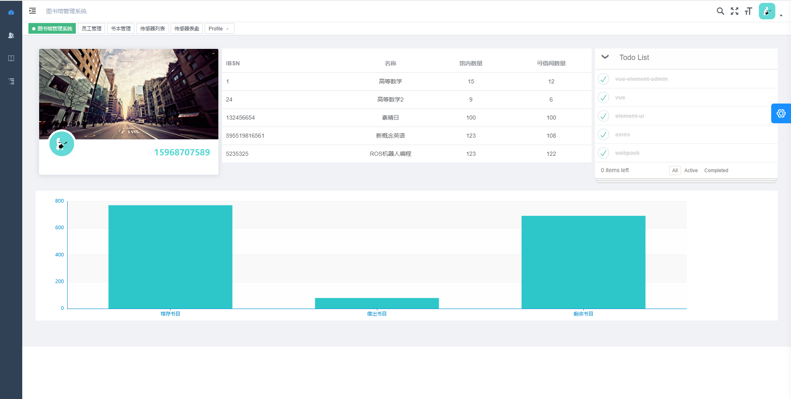

<p align="center">
<a align="center" href="https://github.com/PanJiaChen/vue-element-admin">
  
</a>
</p>

## 基于vue-element-admin开发的基于物联网的图书管理系统




## 后端管理前端部署
---
1. 安装nodejs、npm
2. 在根目录运行
```
npm run dev
```

## License

[MIT](https://github.com/Wh0rigin/GraduationProject-Vue-admin/blob/main/LICENSE)
